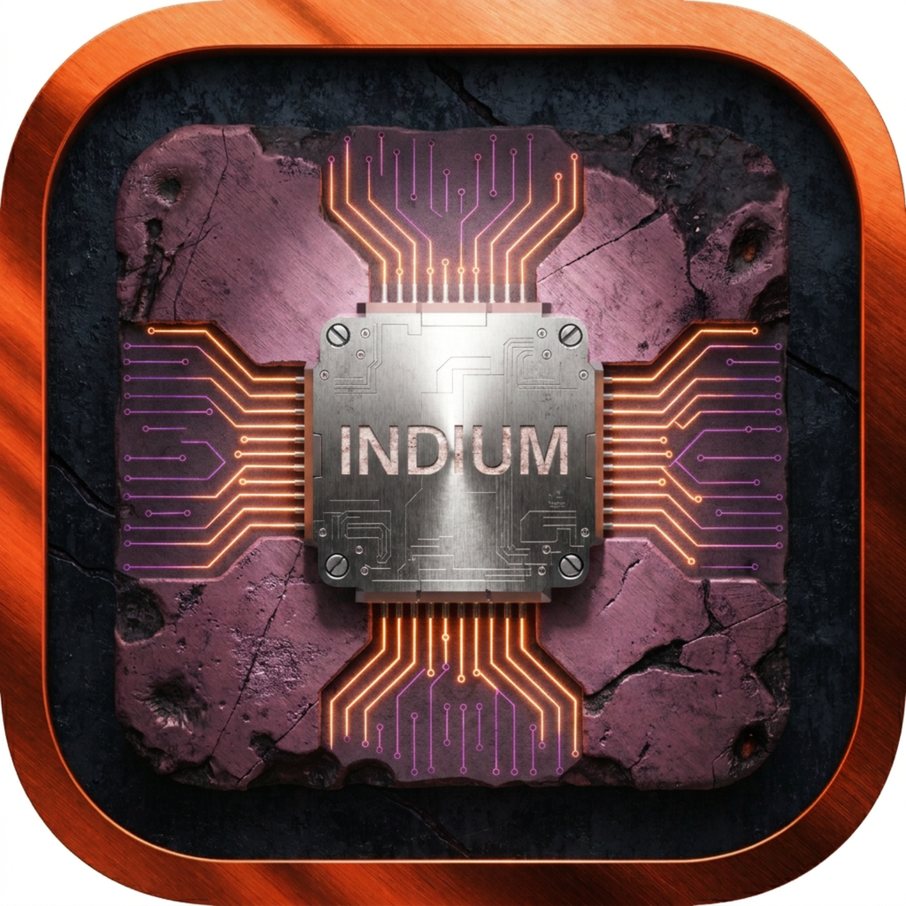
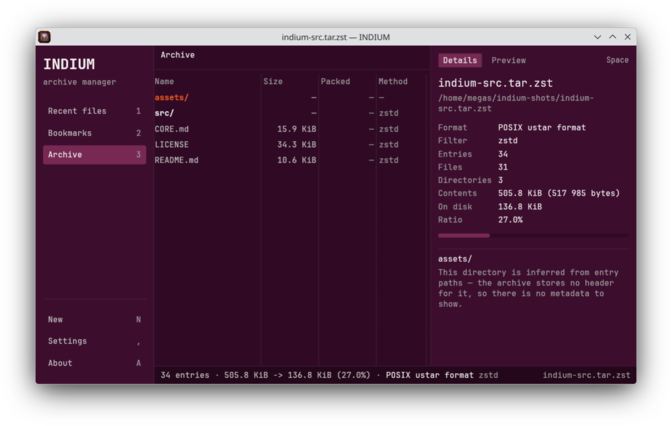
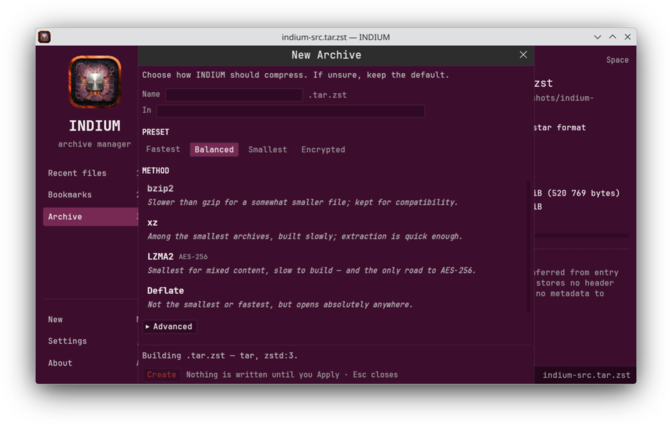
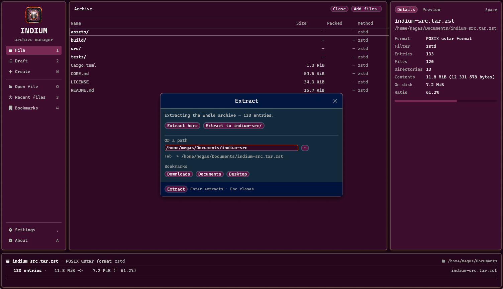
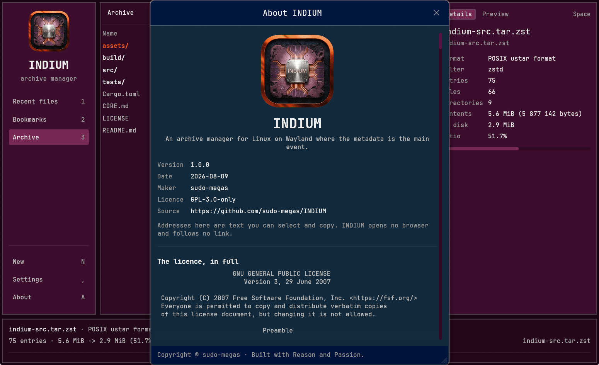

<h1>INDIUM</h1>

<p>
  
  
  
</p>

<p>
  
  
</p>

*Archive manager for Linux on Wayland* · **The metadata is the main event**

---

## 1. DESCRIPTION

INDIUM opens archives — tar, zip, 7z and the rest — and keeps a permanent **Inspector** pane
on screen showing everything there is to know about what you have selected: sizes, packed
sizes, ratio, method, checksums, four timestamps, ownership, mode, link targets, encryption
state. Every other archiver hides that behind a Properties dialog; here it is the main view,
and the stated ambition of the program is to be one of the most verbose archiver applications
in the industry.

Written in Rust and drawn with egui, INDIUM writes nothing in place, sends nothing anywhere,
and calls no other program to do its work — it never runs `7z`, `tar` or `unzip` behind your
back, so a format listed as supported works on any machine, with no archive tools installed
at all.

**RAR is deliberately absent — not read, not written.** Opening one says exactly this and
nothing more: *"RAR is not supported."*



---

## 2. DEPENDENCIES

**To simply use it — nothing to install by hand.**

- **Arch Linux** — the package declares what it needs and `pacman` fetches it.
- **Debian / Ubuntu** — the same; `apt` pulls in what the package asks for.

**To build it yourself:**

- **Arch Linux** — `sudo pacman -S libarchive rust`. That is the whole list.
- **Debian / Ubuntu** — `sudo apt install libarchive-dev pkg-config build-essential`, and
  Rust from [rustup](https://rustup.rs) rather than from `apt`, because bookworm packages
  `rustc` 1.63 and that version cannot build INDIUM.

---

## 3. INSTALLATION

### 3.A Arch Linux

Download `indium-1.0.0-3-x86_64.pkg.tar.zst` from the Releases page:

```sh
sudo pacman -U indium-1.0.0-3-x86_64.pkg.tar.zst
```

### 3.B Debian / Ubuntu

Download `indium_1.0.0-3_amd64.deb` from the Releases page:

```sh
sudo apt install ./indium_1.0.0-3_amd64.deb
```

**The two packages do not have the same floor, and it matters more than the file extension
does.** The `.deb` is built inside `debian:bookworm` and needs **glibc 2.35 or newer** —
which is what it declares, and which covers bookworm, trixie and Ubuntu 22.04 onward. The
`.pkg.tar.zst` is built inside `archlinux:base-devel` and needs **glibc 2.43**, which is
right for the distribution it is for and wrong everywhere else.

### 3.C Anything else

`indium-1.0.0-3-x86_64.tar.gz` is the `.deb`'s binary with no packaging around it, so it carries
the lower of the two floors — glibc 2.35. Unpack it, put `indium` wherever you keep such
things, and satisfy `libarchive.so.13`, `libwayland-client`, `libxkbcommon` and `libEGL`
yourself. It installs no icon and no menu entry; `./build/install-desktop.sh` from a source
checkout is what does that.

All three artefacts are built by
[`.github/workflows/release.yml`](.github/workflows/release.yml), in containers, from the
tag — none of them on the maker's machine. The workflow file is the whole provenance, and
before either package is released INDIUM's own reader opens both and checks they put
identical files on a machine.

No AppImage, no Flatpak, no Snap.

### 3.D Build From Source

```sh
git clone https://github.com/sudo-megas/INDIUM.git
cd INDIUM
cargo build --release
```

The binary lands at `target/release/indium` and runs from there. To add the icon and the
menu entry for your user, run `./build/install-desktop.sh`; add `--set-default` only if you
want archives to open in INDIUM from your file manager, which is a decision left to you
rather than made on your behalf.

---

## 4. HOW TO USE? WHAT IS THE APPLICATION SECTIONS?

Open an archive by clicking it in your file manager, by passing it on the command line, or
with `Ctrl+O` inside the program. **One archive per window** — opening a second one opens a
second window, and there are no tabs. Name several archives on the command line and you get
several windows. Every window stands on its own: close them in any order, and closing one
never closes another.

### The sections

| Section | What it is for |
|---|---|
| **Open file** `O` | Raises your desktop's own file dialog, through `xdg-desktop-portal` — the picker you already know rather than one INDIUM draws. `Ctrl+O` still opens a path field with tab completion, for when you know where you are going. |
| **Archive** `1` | The archive itself: one row per entry, with Name, Size, Packed and Method, and a breadcrumb path above. It handles a hundred thousand entries as smoothly as a hundred. `Enter` goes into a folder, `Backspace` comes back out, `Ctrl+F` filters. |
| **Bookmarks** `2` | Folders you name once and reach thereafter by their name — mostly the places you extract to. They appear again inside the Extract popup, which is the point of them. |
| **Recent files** `3` | The archives you have opened before, newest first, so returning to one is a keypress rather than a hunt through folders. `Enter` opens the highlighted entry and `Del` forgets it. |
| **The Inspector** | The permanent pane on the right, and the reason the program exists. **Details** tells you everything knowable about what you have selected — select nothing and it describes the whole archive, select several and it adds them up. **Preview** shows text and images, judged by their bytes rather than their file extension. `Space` swaps the two. |
| **New Archive** `N` | Builds a new archive. Pick one of four presets — *Fastest*, *Balanced*, *Smallest*, *Encrypted* — or choose a method from the list, where **every method carries one honest sentence** about what it costs you and what it saves. A line at the foot states exactly what is about to be built before anything is. |
| **Pending tasks** `W` | Everything you have changed but not yet committed. A strip appears above the status bar the moment you stage your first change; this is the full list behind it, one row per operation, each removable on its own, with *Discard all* and **Apply**. |
| **Extract** `E` | Unpacks the selection, or the whole archive if nothing is selected. Offers *Extract here*, *Extract to a folder of the same name*, or any path you type, with your bookmarks underneath. |
| **Open With** | Press `Enter` on a file and INDIUM offers the applications that can open it, best match first, filtered as you type. It opens a **copy** — anything you change there does not return to the archive. |
| **Settings** `,` | A small panel: your bookmarks, and whether Extract should start out pointed into a subfolder. It is a plain `settings.toml` you may edit by hand, and INDIUM respects what you write there. |
| **About** `A` | The version and release date, the maker, the source address, and the licence in full. The address is text you can select and copy but not click — INDIUM opens no browser and follows no link, by design. |
| **The status bar** | Three lines at the bottom of the window. The first says which archive this window holds and where it lives; the second the entry count, the real and packed sizes, and whatever INDIUM last had to say to you; the third the progress bar and its **Cancel** while something long is running. |





### The keyboard

| Key | Does |
| --- | --- |
| `1` `2` `3` | Sidebar sections |
| `O` / `I` | Open file · Add files — both raise the desktop's own picker |
| `N` `W` `E` `A` `,` | New Archive · Pending tasks · Extract · About · Settings |
| `F1` | Keys — this table, in the window |
| Arrows, `PgUp/PgDn`, `Home/End` | Move in the table |
| `Enter` / `Backspace` | Descend / go up |
| `Space` | Details ⇄ Preview |
| `Ctrl+F` | Filter bar |
| `Ctrl+A` | Select all |
| `Ctrl+C` | Copy out (extract to runtime dir, URIs to clipboard) |
| `Ctrl+V` / drop files | Stage an add. A drop needs X11 — winit has no Wayland drag-and-drop; `Ctrl+V` and *Add files…* are the routes that always work. |
| `Del` / `F2` | Stage a remove / a rename |
| `Ctrl+O` | Open (path field) |
| `Esc` | Close the topmost popup |

Bare letters are shortcuts, which is why they are suppressed the moment a text field has
focus. There is no modal editing, no `hjkl` and no `:` commands, anywhere.

### What it does with your data

**INDIUM uses the network for nothing at all** — there is no update check, no telemetry, no
analytics and no crash reporting, and the program opens no browser and follows no link.
Passwords for encrypted archives are asked for at the moment they are needed, used, and
wiped; they are never written to a settings file or remembered between uses.

**Nothing is written in place.** Every change you make — adding, removing, renaming — is
staged and shown to you first, and only **Apply** touches the disk. Apply builds the new
archive beside the old one, walks its entries to prove it is sound, and only then puts it in
place. Your original is never modified until its replacement has been verified.

---

## 5. LICENCE SUMMARY

INDIUM is free software under the **GNU General Public License, version 3 only**
(`GPL-3.0-only`).

In plain terms: you may use it for anything, study how it works, share it with anyone, and
change it to suit yourself. If you distribute a changed version, it must carry this same
licence so that whoever receives it has the freedoms you had. It comes with **no warranty**.

That is a summary and nothing more — the text that actually governs is the full
[`LICENSE`](LICENSE) file in this repository, and the same full text is readable inside the
application from the **About** page. The bundled Fira Mono Nerd Font is under the
SIL Open Font Licence 1.1, in [`LICENSES/`](LICENSES).



If you want the design reasoning rather than the instructions, it is all written down:
[`CORE.md`](CORE.md) is the authoritative document and wins over everything else, and
[`build/docs/`](build/docs) records how each milestone was built.

---

Copyright © sudo-megas · <https://github.com/sudo-megas/INDIUM>

*Built with Reason and Passion.*
